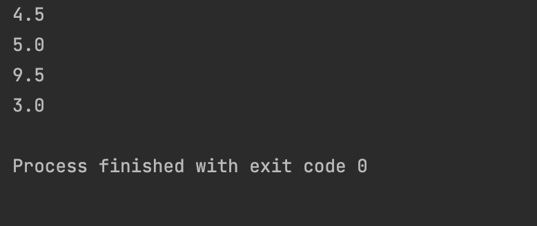

## Code
```.py
def averageLenght(words):
    n = 0
    for i in words:
        n += len(i)
    ans = n/len(words)
    return ans

test1  = averageLenght(["hello","main"])
test2  = averageLenght(["Peru","France", "Nepal"])
test3  = averageLenght(["Computer Science","Art"])
test4  = averageLenght(["one","two"])
print(test1)
print(test2)
print(test3)
print(test4)
```
## Result

## Flow chart

