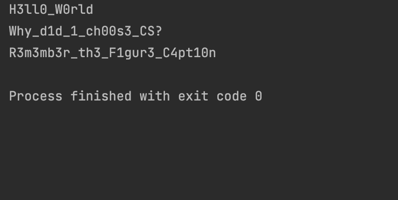

## Code
```.py
def get_13tt3r(msg:str):
    ans = ""
    letters = {"a": "4", "e": "3", "i": "1", "o": "0", " ": "_"}
    for i in msg:
        if i.lower() in letters:
            ans += letters[i.lower()]
        else:
            ans += i
    return ans


test1  = get_13tt3r("Hello World")
test2  = get_13tt3r("Why did I choose CS?")
test3  = get_13tt3r("Remember the Figure Caption")
print(test1)
print(test2)
print(test3)
```
## Result

## Quiz B
,,,
