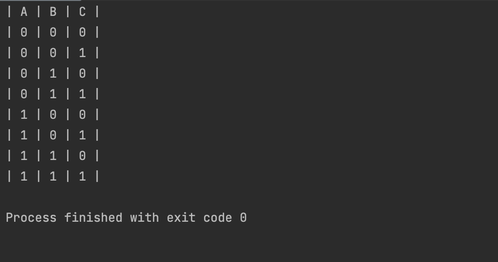

## Code
```.py
def con(a):
    if a == True:
        return "0"
    if a == False:
        return "1"
def get_truth():
    print("| A | B | C |")
    a = False
    b = False
    c = False
    for i in range(8):
        if i%4 == 0:
            a = not a
        if i%2 == 0:
            b = not b
        c = not c
        print(f"| {con(a)} | {con(b)} | {con(c)} |")
get_truth()
```
## Result

## Quiz B
,,,
