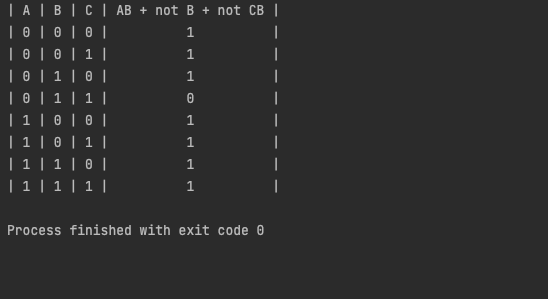

## Code
```.py
def cona(a):
    if a == True:
        return "0"
    if a == False:
        return "1"
def conanotb(notb):
    if notb == True:
        return "0"
    if notb == False:
        return "1"
def get_trutha():
    print("| A | B | C | AB + not B + not CB |")
    a = False
    b = False
    c = False
    for i in range(8):
        if i%4 == 0:
            a = not a
        if i%2 == 0:
            b = not b
        c = not c
        ab = int(cona(a)) * int(cona(b))
        notb = not b
        notbo = conanotb(notb)
        cb = int(cona(c)) * int(cona(b))
        ccb = " "
        if cb == 0:
            ccb = "1"
        else:
            ccb = "0"
        if ab == 0 and notbo == "0" and ccb == "0":
            d = "0"
        else:
            d = "1"
        print(f"| {cona(a)} | {cona(b)} | {cona(c)} |          {d}          |")
get_trutha()
```
## Result

## Quiz B

