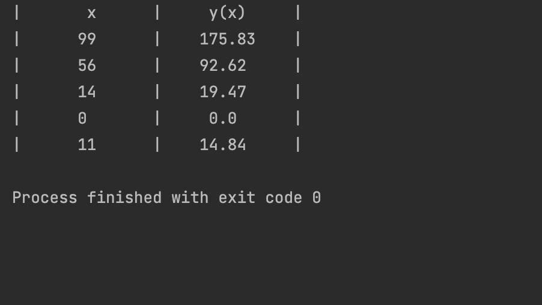

## Code
```.py
import random
random.seed(1234)


def produce(n=5, m=3, s=2):
    print("|       x      |     y(x)     |")
    for i in range(n):
        x = random.randint(0,100)
        y = x**(1/2*(m/s)**2)
        y2 = round(y, 2)
        print(f"|  {str(x).center(10)}  |  {str(y2).center(10)}  |")
    return x, y
produce()
```
## Result

## Quiz B
,,,
