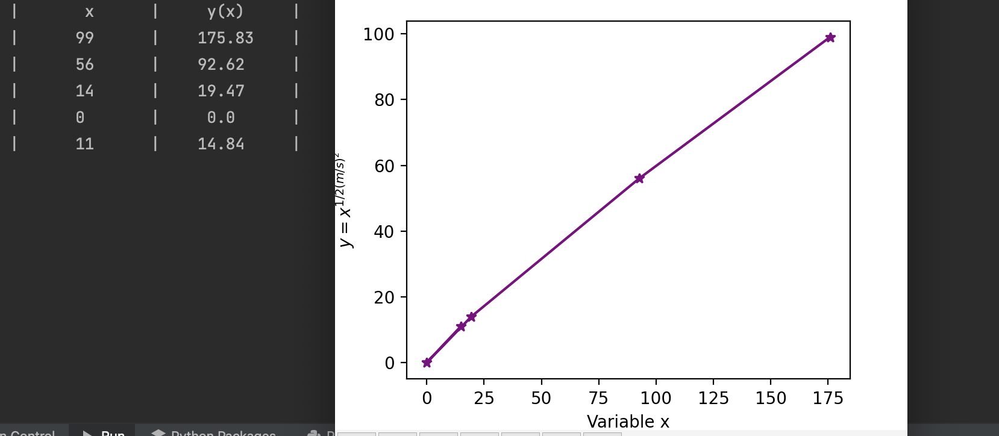

## Code
```.py
import random
random.seed(1234)


def produce(n=int, m=int, s=int):
    print("|       x      |     y(x)     |")
    x_out = []
    y_out = []
    for i in range(5):
        x = random.randint(0,100)
        x_out.append(x)
        y = x**(1/2*(m/s)**2)
        y_out.append(y)
        y2 = round(y, 2)
        print(f"|  {str(x).center(10)}  |  {str(y2).center(10)}  |")
    return x_out, y_out

from matplotlib import pyplot as plt


data_y, data_x  = produce(n=100, m=3, s=2)
plt.plot(data_x, data_y, color="purple", marker="*")
plt.xlabel("Variable x")
plt.ylabel("$ y = x^{1/2(m/s)^2} $")
plt.show()
```
## Result

## Quiz B
,,,
