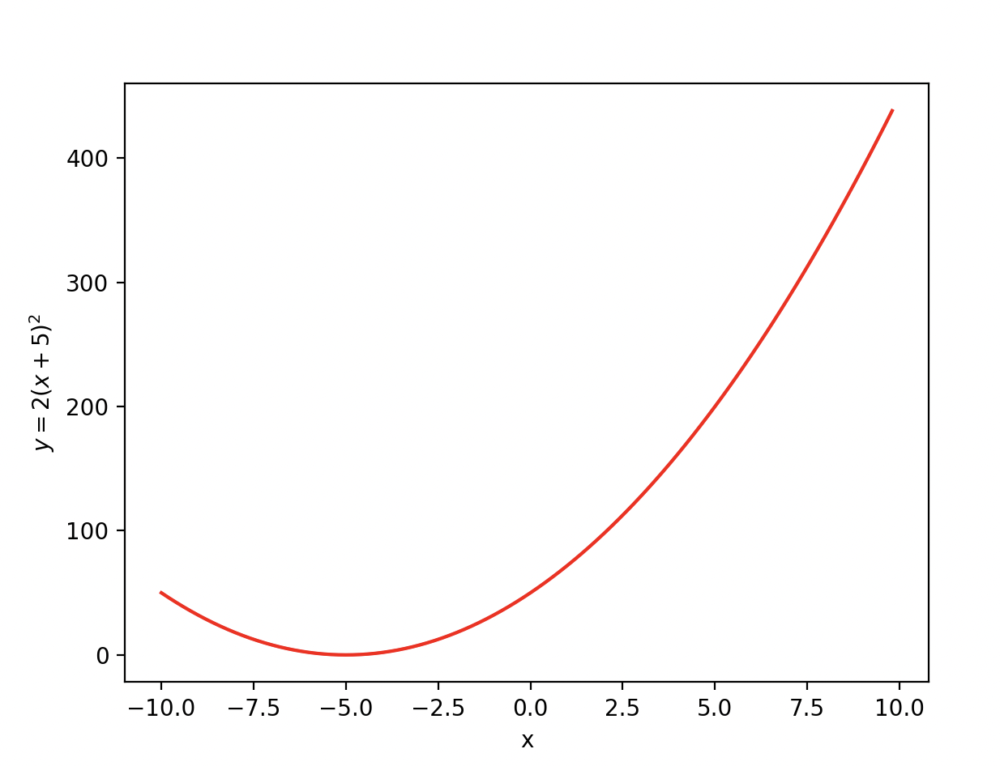

## Code
```.py
from matplotlib import pyplot as plt


def produce1():
    x_out = []
    y_out = []
    for i in range(100):
        x = -10 + i * 0.2
        x_out.append(x)
        y = 2 * (x + 5) ** 2
        y_out.append(y)
    return x_out, y_out

result_y, result_x = produce1()


plt.plot(result_y, result_x, color="Red")
plt.ylabel("$y = 2(x+5)^2$")
plt.xlabel("x")
plt.show()
```
## Result

## Quiz B
,,,
